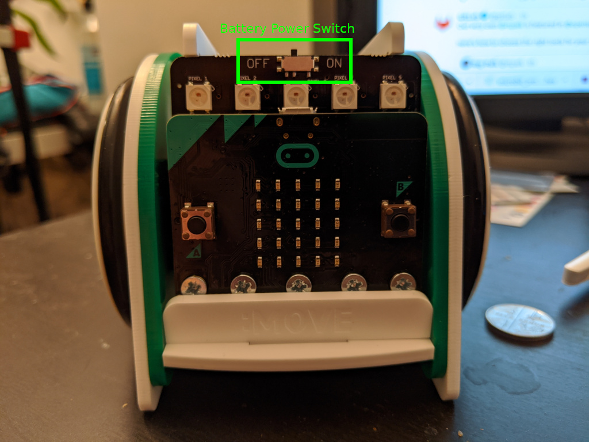

===============
Getting Started
===============

The microbot is developed by `Kitronik <https://www.kitronik.co.uk/5652-move-mini-mk2-buggy-kit-excl-microbit.html>`_.

   The microbot with the power switch highlighted

They have resources for developing programs for the robot using `Make Code <https://makecode.microbit.org/#>`_. You can follow their tutorials for this.

Developing in Python
--------------------

To develop for the microbot in Python, we first need to add some of our own code. First copy the below into the `Python editor <https://python.microbit.org/v/2.0>`_.

.. literalinclude:: /../microbot.py
   :language: python
   :linenos:

We don't have to know much about this block of code for now. It just lets us command the robot.

Movement
--------

Now we've got some building blocks, we can start by making the little guy move around. Tip the robot on it's side so it's right wheel, is in the air.

   Left wheel on the table, right in the air

Now replace the main function we just copied in with the following code.

.. code-block:: python
   :linenos:
   :lineno-start: 73

    def main():
        bot = MicroBot()
        bot.set_wheel_speed(MicroBot.RIGHT_WHEEL, 1)

Turn on the power switch and the right wheel should be spinning clockwise, if it isn't, somethings gone horribly wrong, check your code and then find help.

Once you have that working, try the following.

.. code-block:: python
   :linenos:
   :lineno-start: 73

    def main():
        bot = MicroBot()
        bot.set_wheel_speed(MicroBot.RIGHT_WHEEL, -1)

Turn on the power switch and the left wheel should be spinning anticlockwise, if it isn't, somethings gone horribly wrong, check your code and then find help.

.. admonition:: Have a go
   :class: admonition attention

   Now see if you can make the wheel spin clockwise unless the A button on the microbit is pressed. When this is pressed, the wheel should spin anti-clockwise.

Turn the power back off, and flip the robot onto it's left wheel. Now try the following.

.. code-block:: python
   :linenos:
   :lineno-start: 73

    def main():
        bot = MicroBot()
        bot.set_wheel_speed(MicroBot.LEFT_WHEEL, 1)

Turn on the power switch and the left wheel should be spinning clockwise, if it isn't, somethings gone horribly wrong, check your code and then find help.

You can also alter the speed the wheel moves at like the following.

.. code-block:: python
   :linenos:
   :lineno-start: 73

    def main():
        bot = MicroBot()
        bot.set_wheel_speed(MicroBot.LEFT_WHEEL, 0.5)

When the power is switched on it should turn more slowly.

.. admonition:: Have a go
   :class: admonition attention

   See if you can make the robot:

   * Spin on the spot
   * Move forward slowly
   * Move backwards slowly